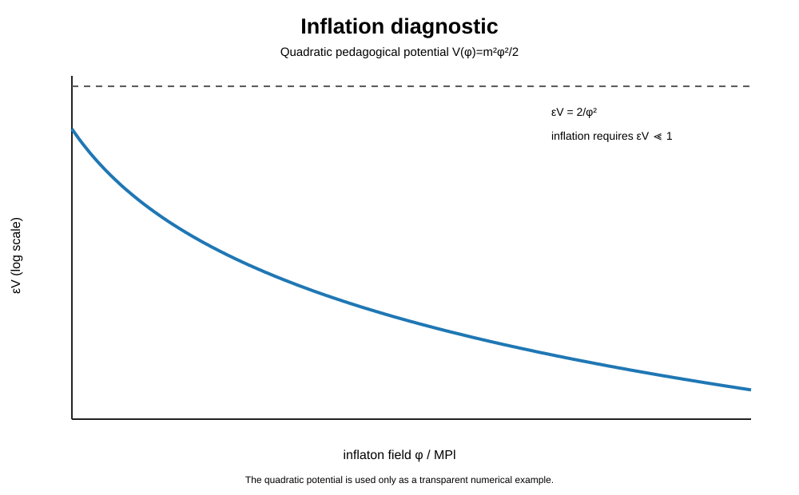

# Multiverse Cosmology Lab

**Author: Biswajit Jana**

A research-driven computational project asking a precise question:

> **What physical mechanisms could generate the hot Big Bang state, what do their equations predict, and can observations distinguish them?**

This repository does **not** assume that a multiverse exists. It treats eternal inflation, false-vacuum bubbles, quantum-cosmology boundary conditions, bounces and cyclic histories as competing model classes whose assumptions and consequences can be calculated.

## Current research status

**Phase 3 / 10.** The repository now has the baseline FLRW/inflation solvers, a research report, explicit origin mechanisms, reheating and bounce toy models, tests, a testability framework and scientific figures. The difficult research phases — perturbation calculations, Euclidean vacuum-decay solutions, quantum-cosmology numerics and data-facing model comparison — are still ahead.

See [ROADMAP.md](ROADMAP.md) for the phase definition.

## Central result so far

The hot Big Bang is a description of an early hot, dense, expanding state. It is not, by itself, an equation for why existence began.

A concrete mechanism can generate the hot state. For example, inflation followed by reheating obeys

$$
\dot\rho_\phi+3H(1+w_\phi)\rho_\phi=-\Gamma_\phi\rho_\phi,
$$

$$
\dot\rho_R+4H\rho_R=\Gamma_\phi\rho_\phi,
$$

$$
H^2=\frac{\rho_\phi+\rho_R}{3M_{\rm Pl}^2}.
$$

When radiation dominates, the usual hot Big Bang thermal history begins. This explains a **transition into** the hot phase; it does not yet explain why the prior state existed.

Read the full derivation and model comparison in [REPORT.md](REPORT.md).

## Scientific model map

The diagram separates four broad routes to a hot expanding phase: inflation/reheating, false-vacuum bubble nucleation, bounce/cyclic cosmology, and quantum boundary proposals. They are not equally established and they do not answer exactly the same question.

## Core equations

### FLRW background

$$
ds^2=-c^2dt^2+a^2(t)\left[\frac{dr^2}{1-kr^2}+r^2d\Omega^2\right]
$$

$$
H^2=
\frac{8\pi G}{3}\rho-\frac{kc^2}{a^2}+\frac{\Lambda c^2}{3}
$$

$$
\dot\rho+3H\left(\rho+\frac{p}{c^2}\right)=0
$$

### Scalar-field inflation

$$
\ddot\phi+3H\dot\phi+V_{,\phi}=0
$$

$$
\epsilon_V=
\frac{M_{\rm Pl}^2}{2}
\left(\frac{V_{,\phi}}{V}\right)^2
$$

### False-vacuum decay

$$
\frac{\Gamma}{V}\sim A\exp\left(-\frac{B}{\hbar}\right)
$$

with the gravitational instanton problem developed by Coleman and De Luccia.

### Effective bounce example

$$
H^2=
\frac{8\pi G}{3}\rho
\left(1-\frac{\rho}{\rho_c}\right)
$$

### Primordial perturbations

$$
\mathcal P_{\mathcal R}
\approx
\frac{H_*^2}{8\pi^2M_{\rm Pl}^2\epsilon_*},
\qquad
r\approx16\epsilon_*.
$$

The project uses observational constraints as a filter on models rather than treating mathematical possibility as evidence.

## What "before the Big Bang" can mean

The phrase can refer to several different questions:

- an earlier classical FLRW phase;
- inflation before reheating;
- a contracting phase before a bounce;
- an inflating false vacuum outside our bubble;
- a quantum boundary rather than a classical earlier time;
- or no meaningful classical "before" at all in a particular boundary proposal.

See [theory/06_why_hot_big_bang.md](theory/06_why_hot_big_bang.md) and [theory/07_singularity_and_past_boundary.md](theory/07_singularity_and_past_boundary.md).

## What singularity theorems do and do not prove

Hawking-Penrose and Borde-Guth-Vilenkin place important restrictions on classical and inflating spacetimes. They establish forms of geodesic incompleteness under stated assumptions. They do **not** uniquely prove "creation from nothing."

That distinction is central to this repository.

## Testability

A theory module is not complete until it states:

1. assumptions;
2. governing equations;
3. numerical variables;
4. predicted observables;
5. failure conditions;
6. current empirical status.

See [theory/08_testability_and_observables.md](theory/08_testability_and_observables.md).

## Repository structure

~~~text
Multiverse/
├── README.md
├── REPORT.md
├── ROADMAP.md
├── theory/
│   ├── 01_big_bang_and_horizons.md
│   ├── 02_flrw_and_friedmann.md
│   ├── 03_inflation_and_eternal_inflation.md
│   ├── 04_multiverse_frameworks.md
│   ├── 05_scientific_status.md
│   ├── 06_why_hot_big_bang.md
│   ├── 07_singularity_and_past_boundary.md
│   └── 08_testability_and_observables.md
├── src/multiverse_cosmology/
│   ├── friedmann.py
│   ├── inflation.py
│   ├── reheating.py
│   └── bounce.py
├── code/
│   ├── notebooks/
│   └── visualizations/
├── assets/figures/
├── tests/
└── references/references.bib
~~~

## Reproduce the calculations

~~~bash
python -m venv .venv
source .venv/bin/activate   # Windows: .venv\Scripts\activate
pip install -e ".[dev]"
pytest
jupyter lab
~~~

The existing numerical models are deliberately labelled as baseline or toy calculations where appropriate. A simple model is useful only when its assumptions are explicit.

## Primary literature

The bibliography includes Guth on inflation, Coleman-De Luccia on vacuum decay, Linde on self-reproducing inflation, Hartle-Hawking and Vilenkin on quantum cosmology, Hawking-Penrose and Borde-Guth-Vilenkin on incompleteness, Steinhardt-Turok on cyclic cosmology, Ashtekar-Singh on loop quantum cosmology, and Planck/BICEP-Keck observational constraints.

See [references/references.bib](references/references.bib).

## Authorship

**Biswajit Jana, 2026.**

The purpose of this repository is to make the reasoning reproducible: equations, assumptions, numerical experiments, citations, tests and failure modes are kept together rather than presenting speculative cosmology as settled fact.
