# Multiverse Cosmology Lab

**Biswajit Jana · 2026**

[**Open the live 3D research story →**](https://biswajit1999.github.io/Multiverse/)

> # Working answer: **INFLATION**
>
> **More precisely:** inflation followed by reheating is the strongest testable bridge found in this project between a pre-hot-Big-Bang state and the hot, structured universe we observe. That is an author synthesis from the implemented theory + simulations + current data — not proof that inflation is the unique history of nature.

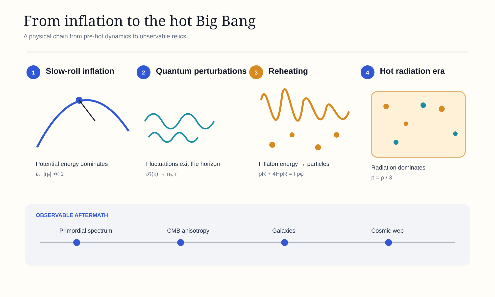

## The problem I am trying to solve

The hot Big Bang tells us how an early hot, dense universe evolves. It does **not** by itself tell us what physical process produced that state.

Instead of ending with a catalogue of theories, this repository asks a sequence of answerable questions:

1. **What does the Big Bang model actually begin with?**
2. **Can an earlier dynamical state generate that hot radiation bath?**
3. **Which candidate histories make observable predictions?**
4. **What do CMB measurements already reject?**
5. **Does a successful inflationary history imply a multiverse?**
6. **What observation would force the working conclusion to change?**

Read the full [question-ledger](RESEARCH_QUESTIONS.md) or the [integrated report](REPORT.md).

## Evidence chain

`pre-hot state → inflation → quantum fluctuations → reheating → hot Big Bang → CMB → galaxies`

At $N=60$, the current implementation gives:

| Inflationary model | $n_s$ | $r$ | Reading against current benchmark |
|---|---:|---:|---|
| Quadratic $V\propto\phi^2$ | 0.96694 | 0.13223 | tensor prediction too large |
| Starobinsky-type plateau | 0.96783 | 0.002964 | remains in the low-$r$ region |

The live site also plots the released NASA/LAMBDA TT-spectrum data used for Planck 2018 + ACT DR6 visualization.

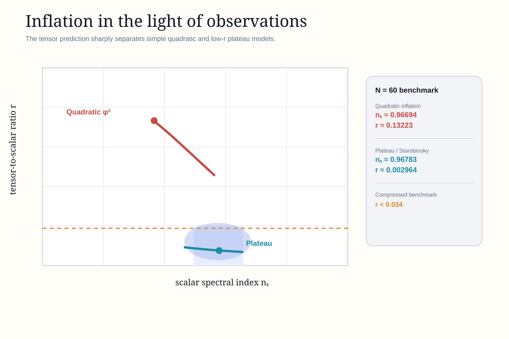

## Why the answer is not simply “multiverse”

Some inflationary models enter a self-reproducing stochastic regime,

$$
\mathcal R_{\rm EI}
\simeq
\frac{3H^3}{2\pi|V_{,\phi}|},
$$

which can produce causally separated reheating regions. That makes a multiverse a possible **consequence of some models**, not an observed premise and not the project's starting answer.

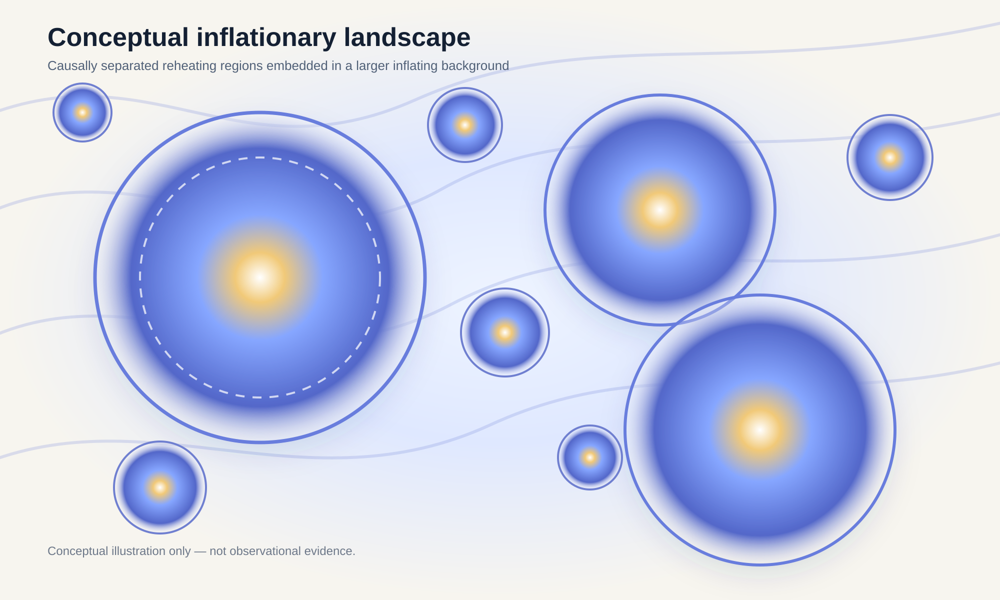

## Research archive and reproducibility

The current release is a complete research framework rather than a claim that the origin problem itself is solved. The repository now spans FLRW background cosmology, inflation and reheating, causal horizons, primordial perturbations, false-vacuum decay and Coleman–De Luccia diagnostics, effective bounces, Wheeler–DeWitt minisuperspace, current observational constraints, reproducible benchmark results, continuous testing, and an interactive research website.

Completion here does **not** mean that the origin of the universe or the multiverse has been solved. It means the original broad question has been decomposed into explicit equations, numerical experiments, observable discriminants, and stated failure conditions.

See [ROADMAP.md](ROADMAP.md), [REPORT.md](REPORT.md), [RESEARCH_SUMMARY.md](RESEARCH_SUMMARY.md), [MODEL_STATUS.md](MODEL_STATUS.md), and [REPRODUCIBILITY.md](REPRODUCIBILITY.md).

## Central physical problem

The hot Big Bang describes an early hot, dense, expanding state. It does not by itself supply a unique physical explanation for why that state existed.

Inflation followed by reheating supplies one concrete transition mechanism:

$$
\dot\rho_\phi+3H(1+w_\phi)\rho_\phi=-\Gamma_\phi\rho_\phi,
$$

$$
\dot\rho_R+4H\rho_R=\Gamma_\phi\rho_\phi,
$$

$$
H^2=\frac{\rho_\phi+\rho_R}{3M_{\rm Pl}^2}.
$$

When radiation dominates, the usual hot Big Bang thermal history begins. This can explain how an earlier vacuum-dominated state becomes hot; it does not yet explain why the earlier state existed.

Read the full argument in [REPORT.md](REPORT.md) and [theory/06_why_hot_big_bang.md](theory/06_why_hot_big_bang.md).

## Scientific model map

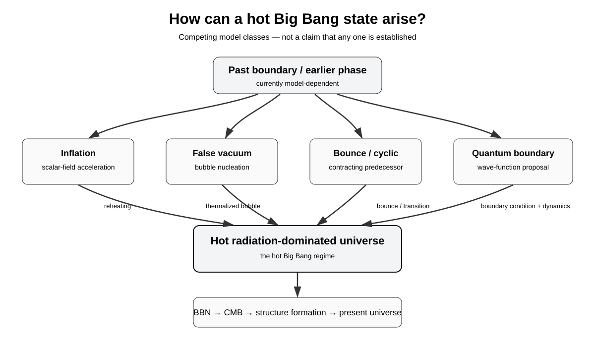

The diagram separates several model classes capable of extending the standard hot-Big-Bang history: inflation/reheating, false-vacuum bubble nucleation, bounce/cyclic cosmology and quantum-boundary proposals. They do not have the same assumptions or empirical status.

## Phase 4 — causal structure

For an FLRW history,

$$
\eta(a)=\frac{1}{H_0}\int^a\frac{da'}{a'^2E(a')},
$$

$$
\chi_p(t)=c\int_{t_i}^{t}\frac{dt'}{a(t')},
\qquad
\chi_e(t)=c\int_t^\infty\frac{dt'}{a(t')},
$$

and the comoving Hubble radius is

$$
(aH)^{-1}.
$$

These quantities make the phrase "outside our universe" more precise: the observable boundary is a causal horizon, not a material wall.

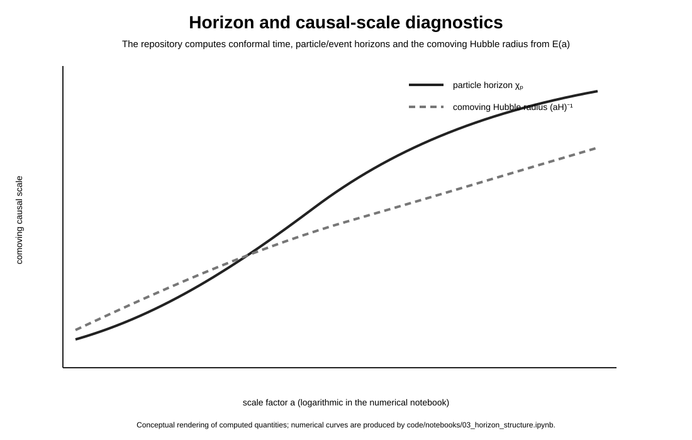

Implementation: [src/multiverse_cosmology/horizons.py](src/multiverse_cosmology/horizons.py)  
Notebook: [code/notebooks/03_horizon_structure.ipynb](code/notebooks/03_horizon_structure.ipynb)

## Phase 5 — inflation model discrimination

For a canonical single-field potential,

$$
\epsilon_V=
\frac{M_{\rm Pl}^2}{2}
\left(\frac{V_{,\phi}}{V}\right)^2,
\qquad
\eta_V=
M_{\rm Pl}^2\frac{V_{,\phi\phi}}{V},
$$

with first-order predictions

$$
n_s\simeq1-6\epsilon_V+2\eta_V,
\qquad
r\simeq16\epsilon_V.
$$

The e-fold number is computed from

$$
N\simeq
\frac{1}{M_{\rm Pl}^2}
\int_{\phi_{\rm end}}^{\phi_*}
\frac{V}{V_{,\phi}}\,d\phi.
$$

At $N=60$, the current calculation gives:

| Model | $n_s$ | $r$ |
|---|---:|---:|
| Quadratic $V\propto\phi^2$ | 0.96694 | 0.13223 |
| Starobinsky-type plateau | 0.96783 | 0.002964 |

The two models have similar scalar tilt but very different tensor predictions. Against the documented BICEP/Keck benchmark $r_{0.05}<0.036$, the simple quadratic prediction at $N\simeq60$ lies above the limit, while the Starobinsky-type prediction lies below it.

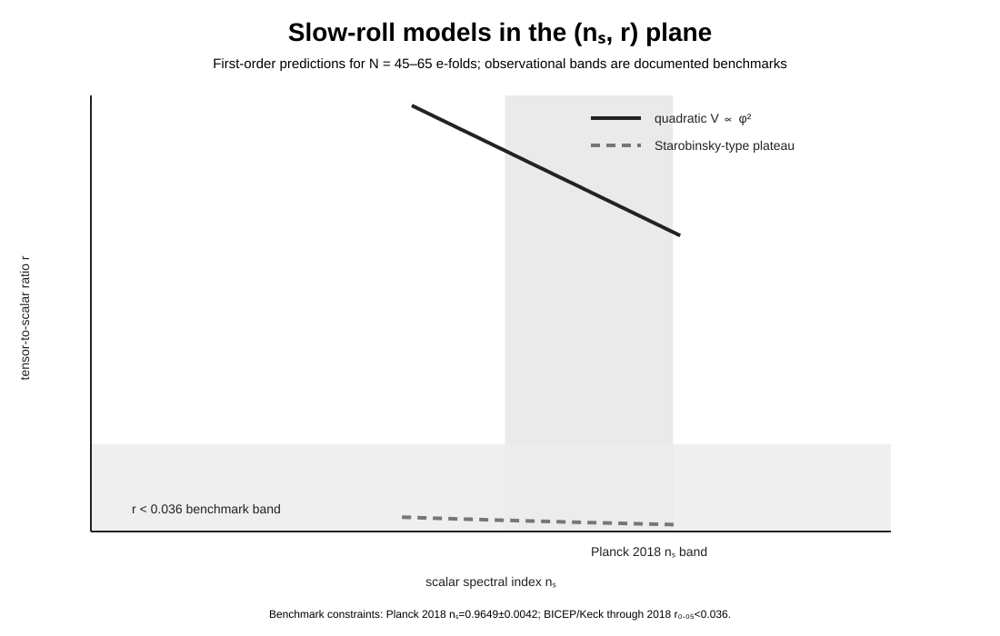

Implementation: [src/multiverse_cosmology/slowroll.py](src/multiverse_cosmology/slowroll.py) and [src/multiverse_cosmology/potentials.py](src/multiverse_cosmology/potentials.py)  
Notebook: [code/notebooks/04_inflation_model_sweep.ipynb](code/notebooks/04_inflation_model_sweep.ipynb)

## Phase 5 — primordial perturbations

Scalar perturbations satisfy the Mukhanov-Sasaki equation

$$
v_k''+\left(k^2-\frac{z''}{z}\right)v_k=0,
\qquad
z=a\frac{\dot\phi}{H}.
$$

The present numerical benchmark uses the exact de-Sitter form

$$
v_k''+\left(k^2-\frac{2}{\eta^2}\right)v_k=0,
$$

whose Bunch-Davies solution is

$$
v_k(\eta)=
\frac{e^{-ik\eta}}{\sqrt{2k}}
\left(1-\frac{i}{k\eta}\right).
$$

For the current $k=1$ validation run, the numerical and analytic late-time amplitudes agree at roughly $5.1\times10^{-11}$ relative difference. This validates the benchmark integrator, not a complete arbitrary-background perturbation calculation.

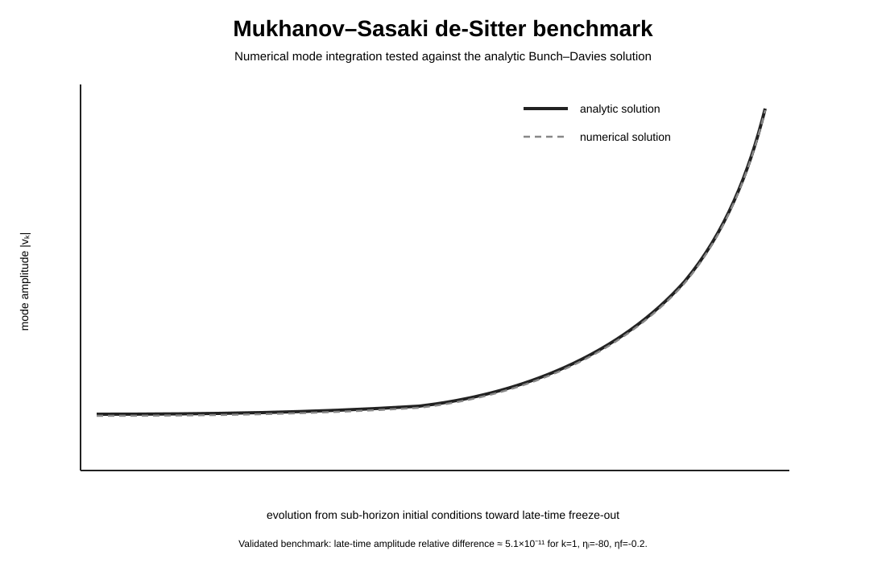

Implementation: [src/multiverse_cosmology/perturbations.py](src/multiverse_cosmology/perturbations.py)  
Notebook: [code/notebooks/05_mukhanov_sasaki.ipynb](code/notebooks/05_mukhanov_sasaki.ipynb)

## Additional origin mechanisms

### False-vacuum decay

$$
\frac{\Gamma}{V}\sim A\exp\left(-\frac{B}{\hbar}\right),
$$

where the Euclidean bounce action controls the semiclassical nucleation rate. A full Coleman-De Luccia numerical solver is the Phase-6 target.

### Effective bounce example

$$
H^2=
\frac{8\pi G}{3}\rho
\left(1-\frac{\rho}{\rho_c}\right).
$$

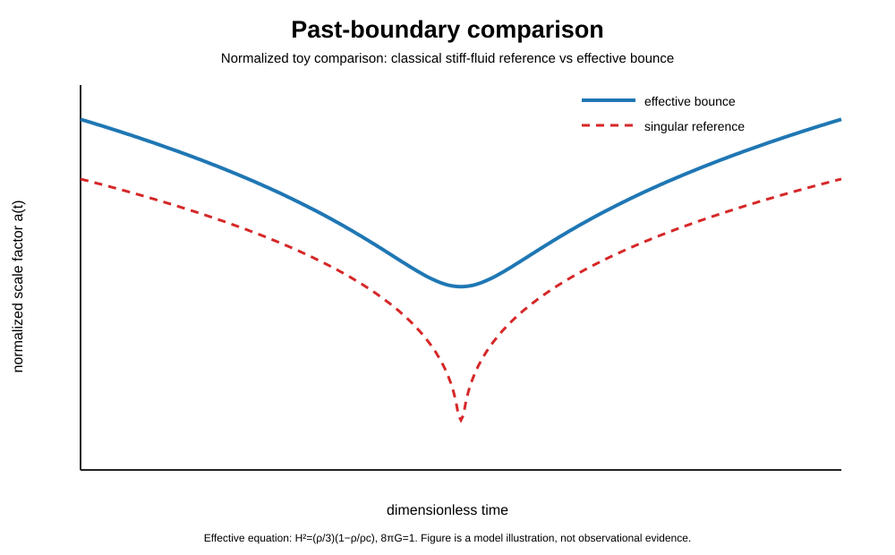

### Quantum cosmology

A canonical quantum-cosmology treatment leads schematically to the Wheeler-DeWitt constraint

$$
\hat{\mathcal H}\Psi[h_{ij},\phi]=0.
$$

The repository treats no-boundary and tunneling proposals as alternative boundary prescriptions to be investigated, not established descriptions of the origin of the universe.

## Phase 6–8 — vacuum decay, quantum cosmology, and current data

For an $O(4)$-symmetric Euclidean scalar–gravity system,

$$
\phi''+3\frac{\rho'}{\rho}\phi'=V_{,\phi},
\qquad
\rho''=-\frac{\rho}{3M_{\rm Pl}^2}\left(\phi'^2+V\right),
$$

with constraint

$$
\rho'^2=1+\frac{\rho^2}{3M_{\rm Pl}^2}\left(\frac12\phi'^2-V\right).
$$

The code now includes these Coleman–De Luccia trajectory equations, thin-wall and Hawking–Moss limits, a Fubini–Lipatov benchmark, and a stochastic self-reproduction diagnostic. It also includes a Wheeler–DeWitt minisuperspace solver with an analytic WKB check.

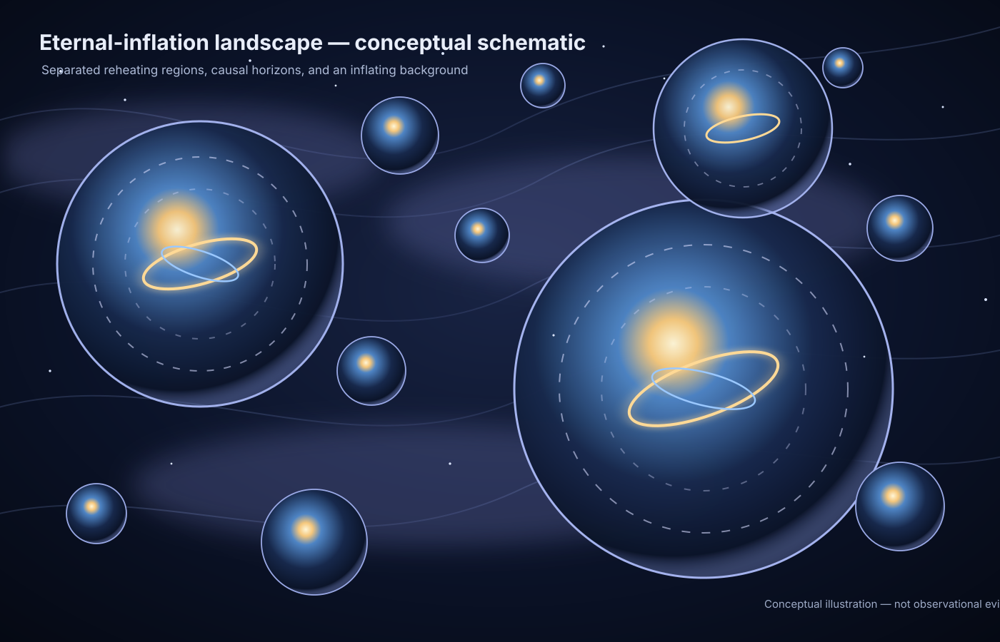

*Conceptual illustration only — not observational evidence of other universes.*

*Inflationary extension, nonsingular bounce, and cyclic evolution are distinct theoretical model classes.*

The observational layer stores versioned 2026 compressed constraints instead of treating one data combination as timeless. See [theory/15_observational_status_2026.md](theory/15_observational_status_2026.md) and [data/constraints_2026.json](data/constraints_2026.json).

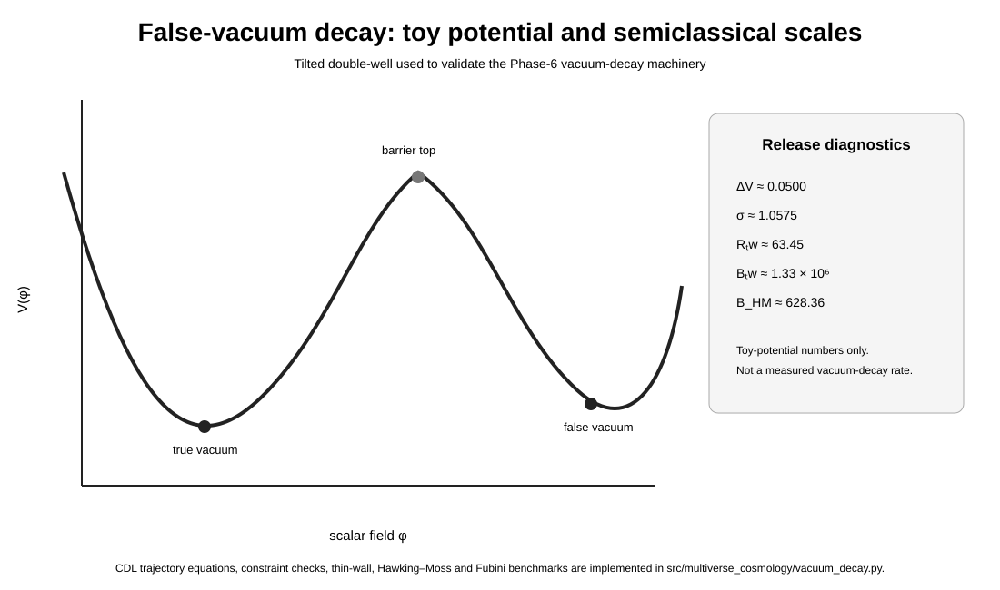

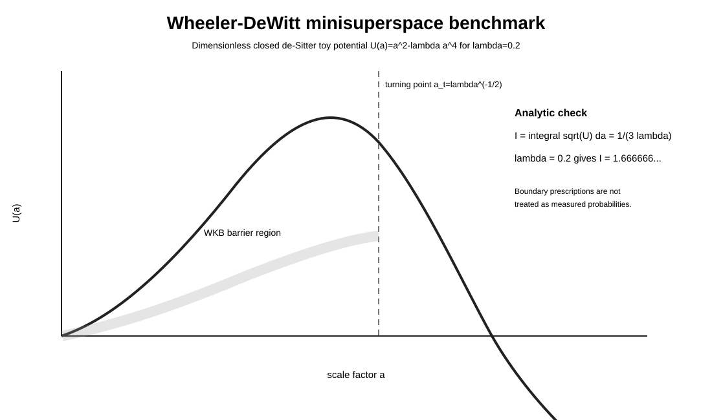

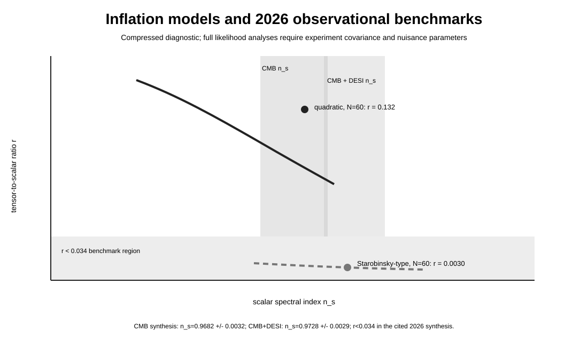

The live editorial research interface is deployed at **https://biswajit1999.github.io/Multiverse/**. It includes a live slow-roll explorer and a CMB TT chart built from the NASA/LAMBDA February 2026 public plotting table (Planck 2018 + ACT DR6 data).

## What "before the Big Bang" can mean

The phrase may refer to an earlier classical phase, inflation before reheating, contraction before a bounce, an inflating false vacuum outside a bubble, a quantum boundary rather than earlier classical time, or no classical "before" at all in a particular proposal.

See:

- [theory/06_why_hot_big_bang.md](theory/06_why_hot_big_bang.md)
- [theory/07_singularity_and_past_boundary.md](theory/07_singularity_and_past_boundary.md)
- [theory/09_horizons_and_causality.md](theory/09_horizons_and_causality.md)
- [theory/10_inflation_model_discrimination.md](theory/10_inflation_model_discrimination.md)
- [theory/11_primordial_perturbations.md](theory/11_primordial_perturbations.md)

## Repository structure

~~~text
Multiverse/
├── README.md
├── REPORT.md
├── RESEARCH_SUMMARY.md
├── MODEL_STATUS.md
├── REPRODUCIBILITY.md
├── ROADMAP.md
├── CHANGELOG.md
├── theory/                    # 01–16 research chapters
├── src/multiverse_cosmology/
│   ├── friedmann.py
│   ├── inflation.py
│   ├── reheating.py
│   ├── bounce.py
│   ├── horizons.py
│   ├── potentials.py
│   ├── slowroll.py
│   ├── perturbations.py
│   ├── vacuum_decay.py
│   ├── quantum_cosmology.py
│   └── constraints.py
├── code/notebooks/           # 01–08 reproducible notebooks
├── code/visualizations/
├── data/constraints_2026.json
├── results/benchmark_results.json
├── scripts/run_phase10.py
├── docs/                     # interactive research website
├── assets/
├── tests/
└── references/references.bib
~~~

## Reproduce the v1.0 release

~~~bash
python -m venv .venv
source .venv/bin/activate   # Windows: .venv\Scripts\activate
pip install -e ".[dev]"
pytest
jupyter lab
~~~

The complete v1.0 numerical suite was locally validated with **29 tests**, covering background dynamics, inflation, horizons, reheating, bounce dynamics, perturbations, false-vacuum decay limits, Euclidean gravitational constraints, Wheeler–DeWitt benchmarks, and observational-constraint logic.

Run `python scripts/run_phase10.py` to regenerate the deterministic benchmark summary in `results/benchmark_results.json`.

## Scientific standard used here

A model is not promoted merely because its equations admit an interesting solution. Each theory is expected to state:

1. assumptions;
2. governing equations;
3. initial/boundary conditions;
4. numerical implementation;
5. predicted observables;
6. known degeneracies;
7. failure conditions;
8. current empirical status.

The project therefore aims to turn the broad question "what happened before the Big Bang?" into a sequence of falsifiable or at least quantitatively constrained sub-problems.

## Primary literature

The bibliography includes Guth, Starobinsky, Coleman-De Luccia, Linde, Hartle-Hawking, Vilenkin, Mukhanov, Sasaki, Hawking-Penrose, Borde-Guth-Vilenkin, Steinhardt-Turok, Ashtekar-Singh, Planck and BICEP/Keck.

See [references/references.bib](references/references.bib).

## Authorship

**Biswajit Jana, 2026.**

The repository is presented as a scientific research record: equations, assumptions, code, tests, figures, references, limitations, and versioned results are kept together.

The purpose of this repository is to make the reasoning reproducible: equations, assumptions, numerical experiments, citations, tests and failure modes are kept together rather than presenting speculative cosmology as settled fact.
