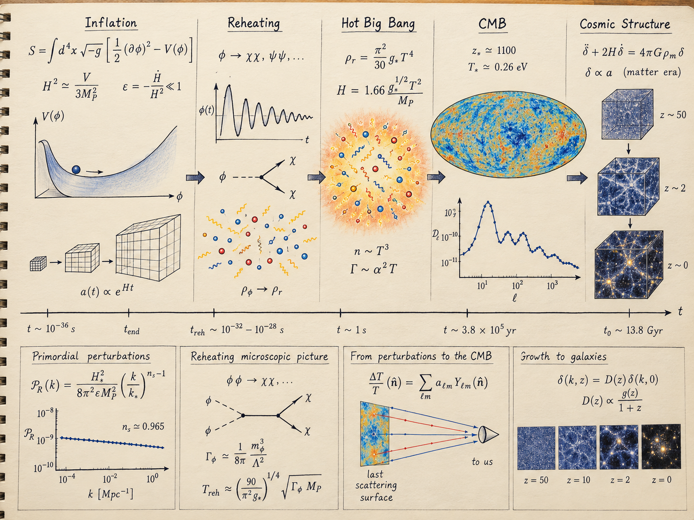
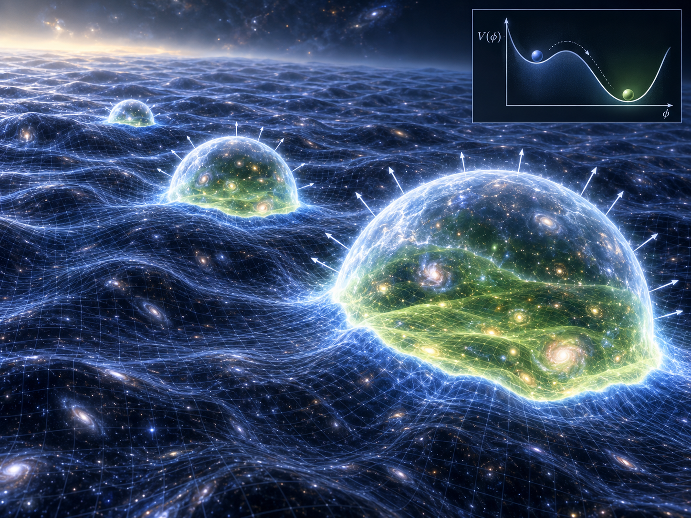
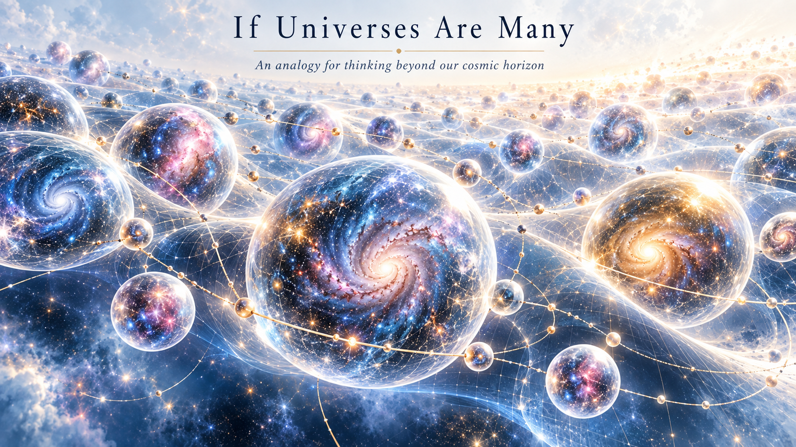
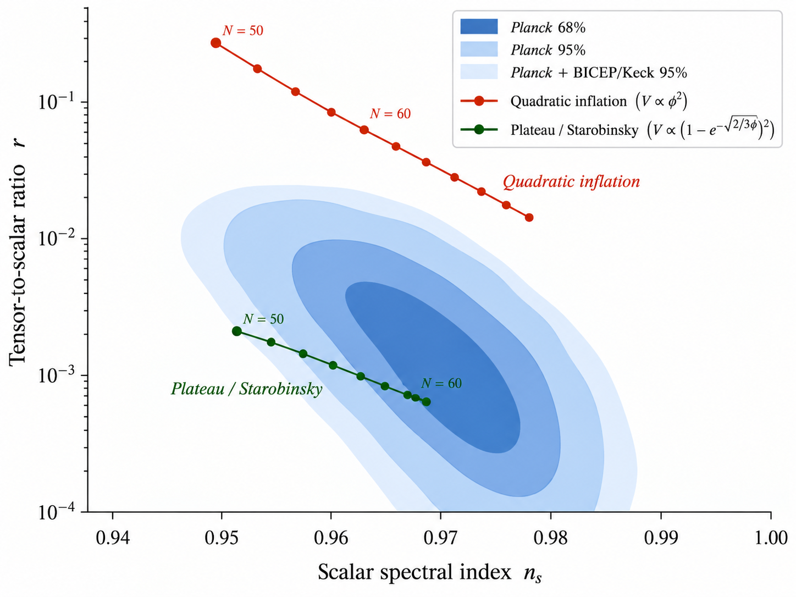
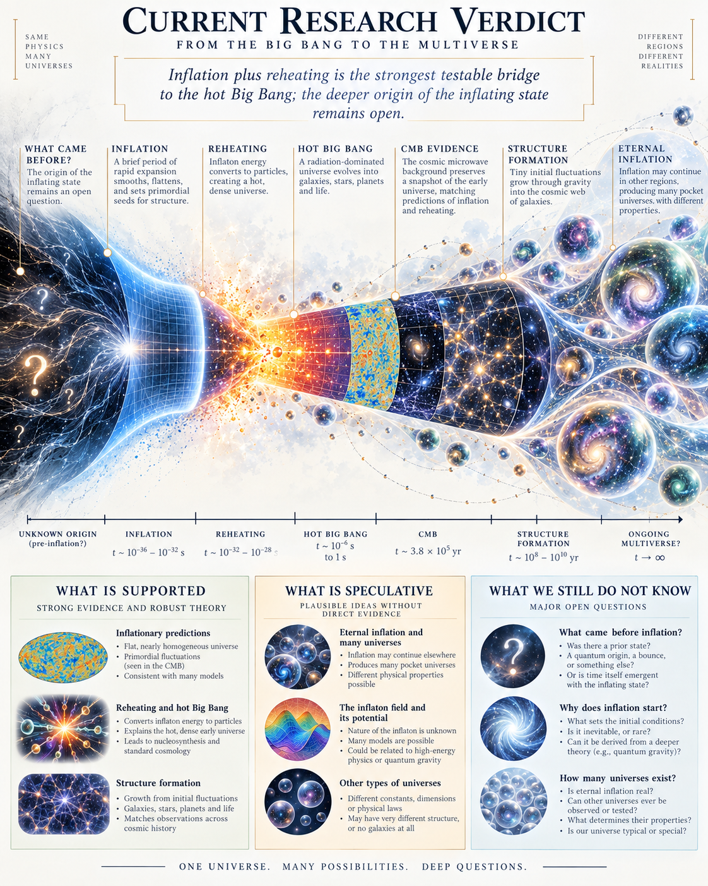

# Integrated Research Report — Cosmic Origins and Multiverse Cosmology

**Multiverse Cosmology Lab v1.0 · 2026**

**Author: Biswajit Jana**

## Abstract

This project asks a narrower and more scientifically useful question than "Did the Big Bang create everything?":

> **Which physically motivated cosmological models can generate the hot Big Bang state, what assumptions do they require, and what observable consequences could distinguish them?**

The hot Big Bang is an empirically successful description of an early hot, dense, expanding phase. It is **not**, by itself, a theory of why spacetime exists or why the hot phase began. General relativity extrapolated backward can become geodesically incomplete; inflation can provide a pre-hot-Big-Bang accelerated phase and a mechanism for reheating; false-vacuum decay can generate bubble interiors; quantum-cosmology proposals attempt to specify a boundary condition for the universe; and bounce/cyclic models replace a classical singular boundary by a contracting predecessor. None of these currently supplies an experimentally established answer to the ultimate origin question.

The computational aim is therefore not to "prove the multiverse." It is to build reproducible model classes, derive their dynamics, compute their signatures, and identify where present observations can or cannot discriminate between them.

---

## 1. What exactly was the Big Bang?

A homogeneous and isotropic universe is described by the FLRW line element

$$
ds^2=-c^2dt^2+a^2(t)\left[\frac{dr^2}{1-kr^2}+r^2d\Omega^2\right].
$$

Einstein's equations reduce to the Friedmann equations

$$
H^2=\left(\frac{\dot a}{a}\right)^2
=\frac{8\pi G}{3}\rho-\frac{kc^2}{a^2}+\frac{\Lambda c^2}{3},
$$

$$
\frac{\ddot a}{a}
=-\frac{4\pi G}{3}\left(\rho+\frac{3p}{c^2}\right)
+\frac{\Lambda c^2}{3},
$$

with local energy conservation

$$
\dot\rho+3H\left(\rho+\frac{p}{c^2}\right)=0.
$$

For a component with equation of state $p=w\rho c^2$,

$$
\rho(a)\propto a^{-3(1+w)}.
$$

Radiation has $w=1/3$, pressureless matter has $w=0$, and a cosmological constant has $w=-1$.

The **hot Big Bang** is the radiation-dominated state from which standard thermal history proceeds. The model is supported by the cosmic microwave background, primordial nucleosynthesis, cosmic expansion, and large-scale structure. The term should not be conflated with a proven absolute beginning of spacetime.

---

## 2. Why did the hot Big Bang happen?

At present, physics does not have a unique experimentally established answer.

There are, however, several concrete mechanisms that can *produce* a hot expanding universe.

### 2.1 Inflation followed by reheating

A canonical inflaton field obeys

$$
\ddot\phi+3H\dot\phi+V_{,\phi}=0,
$$

with

$$
\rho_\phi=\frac{1}{2}\dot\phi^2+V(\phi),
\qquad
p_\phi=\frac{1}{2}\dot\phi^2-V(\phi).
$$

If potential energy dominates, $p_\phi\approx-\rho_\phi$ and the expansion accelerates.

Slow-roll parameters may be written as

$$
\epsilon_V=\frac{M_{\rm Pl}^2}{2}
\left(\frac{V_{,\phi}}{V}\right)^2,
\qquad
\eta_V=M_{\rm Pl}^2\frac{V_{,\phi\phi}}{V}.
$$

Inflation requires approximately $\epsilon_V\ll1$ and $|\eta_V|\ll1$.

Inflation does not itself give the hot thermal universe. A reheating phase must transfer inflaton energy into ordinary particles. A minimal phenomenological model is

$$
\dot\rho_\phi+3H(1+w_\phi)\rho_\phi=-\Gamma_\phi\rho_\phi,
$$

$$
\dot\rho_R+4H\rho_R=\Gamma_\phi\rho_\phi,
$$

$$
H^2=\frac{\rho_\phi+\rho_R}{3M_{\rm Pl}^2}.
$$

When radiation becomes dominant, the system enters the hot Big Bang regime. In perturbative reheating a characteristic temperature scale is of order

$$
T_{\rm reh}\sim
\left(\frac{90}{\pi^2g_*}\right)^{1/4}
\sqrt{\Gamma_\phi M_{\rm Pl}},
$$

up to model-dependent factors.

**Interpretation:** inflation + reheating can explain *how a cold vacuum-dominated phase becomes a hot expanding universe*. It does not yet explain why the inflating state existed in the first place.

*Conceptual research illustration of the inflation → reheating → hot-Big-Bang → CMB → structure chain. The image is explanatory; quantitative claims are supported by the equations and code in this report.*

### 2.2 False-vacuum decay and bubble nucleation

A scalar potential can possess a metastable false vacuum. Semiclassical vacuum decay proceeds through bubble nucleation. Schematically,

$$
\frac{\Gamma}{V}\sim A\exp\left(-\frac{B}{\hbar}\right),
$$

where $B$ is the Euclidean bounce-action difference between the instanton and false vacuum. Coleman and De Luccia included gravitational effects in this process.

If the surrounding false vacuum expands sufficiently rapidly while bubbles nucleate locally, inflation can continue globally while ending in individual regions. This is one route to **eternal inflation** and to the idea of many causally disconnected reheating regions.

This is a theoretical possibility, not an observation of other universes.

*Conceptual illustration of false-vacuum decay and bubble nucleation. It is not observational evidence for another universe.*

### 2.3 Quantum cosmology

Canonical quantum gravity leads schematically to the Wheeler-DeWitt constraint

$$
\hat{\mathcal H}\Psi[h_{ij},\phi]=0.
$$

In minisuperspace one reduces the degrees of freedom to a scale factor and a small number of matter fields, leading schematically to an equation of the form

$$
\left[
-\frac{\partial^2}{\partial a^2}
+U(a,\phi)
\right]\Psi(a,\phi)=0,
$$

with factor-ordering and normalization details depending on the model.

The Hartle-Hawking no-boundary proposal defines a wave function using a Euclidean path integral over compact geometries. Vilenkin's tunneling proposal uses a different boundary prescription and interprets nucleation into an expanding de Sitter-like region through quantum tunneling.

These are attempts to specify a quantum boundary condition, not established empirical descriptions of cosmic origin.

### 2.4 Bounce cosmology

In effective loop quantum cosmology, a commonly used effective equation is

$$
H^2=
\frac{8\pi G}{3}\rho
\left(1-\frac{\rho}{\rho_c}\right).
$$

At $\rho=\rho_c$, $H=0$ and the classical singular evolution can be replaced by a bounce. For a constant equation-of-state parameter $w>-1$, a normalized solution of the effective system can be written

$$
a(t)=a_b
\left[
1+6\pi G\rho_c(1+w)^2t^2
\right]^{1/[3(1+w)]}.
$$

The existence of a bounce in an effective model does not by itself establish that the full quantum-gravity theory describes nature, but it gives a mathematically explicit alternative to a singular boundary.

### 2.5 Ekpyrotic and cyclic scenarios

Ekpyrotic models use a slowly contracting phase with a very stiff effective equation of state, often $w\gg1$, to smooth and flatten the universe before a transition to expansion. Cyclic models repeat contraction/expansion epochs.

A typical scalar realization uses a steep negative potential; one may obtain

$$
w_\phi=
\frac{\frac12\dot\phi^2-V}
{\frac12\dot\phi^2+V}
\gg1.
$$

The crucial theoretical challenge is controlling the transition through the would-be crunch/bang region and obtaining predictions consistent with perturbation observations.

---

## 3. Does a singularity theorem prove an absolute beginning?

No.

The Hawking-Penrose singularity theorems establish geodesic incompleteness under specific assumptions involving causal structure, energy conditions, and focusing. Geodesic incompleteness means that some timelike or null geodesics cannot be extended indefinitely within the spacetime description.

The Borde-Guth-Vilenkin result gives a different kinematical condition. If the expansion rate averaged along a suitable past-directed geodesic satisfies

$$
H_{\rm av}>0,
$$

then the spacetime is past geodesically incomplete along that geodesic.

This is an important restriction on many eternally inflating constructions, but **past incompleteness is not a theorem that the universe was created from nothing**. It says the inflating description requires additional physics at its past boundary.

---

## 4. Where does the multiverse enter?

A multiverse is not required by the hot Big Bang equations.

It can arise in specific extensions:

1. **Eternal inflation:** different regions stop inflating at different times.
2. **False-vacuum landscapes:** different bubble interiors may settle into different vacuum states.
3. **String landscape scenarios:** many metastable compactifications may produce many low-energy effective theories.
4. **Quantum branching:** many-worlds quantum mechanics is conceptually distinct from cosmological pocket universes and should not be conflated with them.
5. **Large/infinite spatial cosmology:** regions beyond our observable horizon may exist even without bubble nucleation; this is different again from a Level-II-style landscape multiverse.

A scientifically serious project must therefore use the word *multiverse* with a model label, not as a single theory.

*Conceptual analogy only. The figure explores how a many-universe picture might be visualized without treating the analogy as empirical evidence.*

---

## 5. Perturbations and observational constraints

For single-field slow-roll inflation the scalar curvature power spectrum is approximately

$$
\mathcal P_{\mathcal R}(k)
\approx
\frac{H_*^2}
{8\pi^2M_{\rm Pl}^2\epsilon_*},
$$

and the tensor power spectrum is approximately

$$
\mathcal P_T(k)
\approx
\frac{2H_*^2}{\pi^2M_{\rm Pl}^2}.
$$

The tensor-to-scalar ratio is therefore

$$
r\equiv\frac{\mathcal P_T}{\mathcal P_{\mathcal R}}
\approx16\epsilon_*.
$$

Planck 2018 measured a scalar spectral index close to but below unity, $n_s=0.9649\pm0.0042$ (68% confidence in the quoted analysis). BICEP/Keck data through the 2018 observing season constrained $r_{0.05}<0.036$ at 95% confidence.

Any proposed pre-hot-Big-Bang mechanism must ultimately connect to observables of this kind.

*Illustrative guide to the model-selection logic in the \(n_s-r\) plane. Numerical comparisons in the repository should be treated as the quantitative reference, not the artwork itself.*

Potential discriminants include:

- scalar spectral tilt $n_s$;
- tensor-to-scalar ratio $r$;
- primordial non-Gaussianity;
- running or features in the primordial power spectrum;
- spatial curvature;
- stochastic gravitational-wave backgrounds;
- CMB signatures proposed for bubble collisions;
- topology signatures;
- bounce/cyclic oscillatory or blue-tilted spectra, where a concrete model predicts them.

Absence of a predicted signal can rule out a specific parameterized model even if it cannot rule out the broad philosophical idea of a multiverse.

---

## 6. The actual research problem

The useful problem statement for this repository is:

> **Given a specified early-universe model and parameter set, can it (i) generate an expanding hot radiation-dominated phase, (ii) remain mathematically self-consistent through its past boundary or transition, (iii) reproduce measured cosmological observables, and (iv) make at least one prediction that differs from competing models?**

That question can be attacked computationally.

### Work package A — Background dynamics

Integrate

$$
\dot a=aH,
$$

together with the matter/scalar equations for inflation, reheating, bounce, and cyclic toy models.

### Work package B — Horizon structure

Compute conformal time

$$
\eta=\int\frac{dt}{a(t)}
$$

and the comoving particle horizon

$$
\chi_{\rm p}(t)
=c\int_{t_i}^{t}\frac{dt'}{a(t')}.
$$

This directly tests causal-contact questions.

### Work package C — Inflation diagnostics

Compute $\epsilon_H=-\dot H/H^2$, e-fold number

$$
N=\int H\,dt,
$$

end-of-inflation conditions, reheating onset, and perturbation observables.

### Work package D — Bubble nucleation toy models

For a chosen scalar potential, solve the Euclidean bounce boundary-value problem and estimate

$$
B=S_E[\phi_{\rm bounce}]-S_E[\phi_{\rm false}].
$$

This is a substantially deeper target than drawing random bubbles.

### Work package E — Past-boundary model comparison

Compare a singular FLRW reference, effective bounce, inflationary extension, and quantum-boundary toy model using common diagnostics: curvature, proper time, geodesic extension, energy density, and horizon size.

### Work package F — Data-facing tests

Use public CMB likelihood products or compressed constraints to compare predicted $(n_s,r)$ regions and other signatures with observation.

---

## 7. What would count as progress?

A useful result is not "the multiverse exists."

Progress would be any of the following:

- a reproducible demonstration that a model fails to reach a hot radiation-dominated state;
- a parameter map showing which initial conditions yield sufficient inflation;
- a numerical bounce that remains finite under specified effective equations;
- a false-vacuum tunneling calculation reproducing a known limiting result;
- a perturbation prediction excluded by data;
- a comparison showing two origin scenarios are observationally degenerate at current sensitivity;
- an identified observable that could distinguish two currently viable scenarios.

That is the level at which the project becomes research-like.

---

## 8. Current conclusion

The best-supported statement is deliberately limited:

**We know a great deal about the evolution of the universe after it was hot and dense. We do not yet know the unique physical cause of that hot state, whether spacetime had an earlier phase, whether a quantum boundary replaces the classical singularity, or whether other causally disconnected universes exist.**

Inflation plus reheating provides a concrete mechanism for producing a hot Big Bang phase. Eternal inflation can, in some models, produce many reheating regions. Bounce and cyclic models provide alternatives to a singular past boundary. Quantum-cosmology proposals attempt to specify boundary conditions. None is presently established as the unique origin history.

---

## Primary literature

1. A. H. Guth, *Inflationary universe: A possible solution to the horizon and flatness problems*, Phys. Rev. D **23**, 347 (1981), DOI: 10.1103/PhysRevD.23.347.
2. S. Coleman & F. De Luccia, *Gravitational effects on and of vacuum decay*, Phys. Rev. D **21**, 3305 (1980), DOI: 10.1103/PhysRevD.21.3305.
3. A. D. Linde, *Eternally existing self-reproducing chaotic inflationary universe*, Phys. Lett. B **175**, 395 (1986), DOI: 10.1016/0370-2693(86)90611-8.
4. J. B. Hartle & S. W. Hawking, *Wave function of the Universe*, Phys. Rev. D **28**, 2960 (1983), DOI: 10.1103/PhysRevD.28.2960.
5. A. Vilenkin, *Quantum creation of universes*, Phys. Rev. D **30**, 509(R) (1984), DOI: 10.1103/PhysRevD.30.509.
6. B. S. DeWitt, *Quantum Theory of Gravity. I. The Canonical Theory*, Phys. Rev. **160**, 1113 (1967), DOI: 10.1103/PhysRev.160.1113.
7. S. W. Hawking & R. Penrose, *The singularities of gravitational collapse and cosmology*, Proc. R. Soc. A **314**, 529 (1970), DOI: 10.1098/rspa.1970.0021.
8. A. Borde, A. H. Guth & A. Vilenkin, *Inflationary spacetimes are incomplete in past directions*, Phys. Rev. Lett. **90**, 151301 (2003), DOI: 10.1103/PhysRevLett.90.151301.
9. P. J. Steinhardt & N. Turok, *Cosmic evolution in a cyclic universe*, Phys. Rev. D **65**, 126003 (2002), DOI: 10.1103/PhysRevD.65.126003.
10. A. Ashtekar & P. Singh, *Loop Quantum Cosmology: A Status Report*, Class. Quantum Grav. **28**, 213001 (2011), arXiv:1108.0893.
11. Planck Collaboration, *Planck 2018 results. X. Constraints on inflation*, A&A **641**, A10 (2020), arXiv:1807.06211.
12. BICEP/Keck Collaboration, *Improved Constraints on Primordial Gravitational Waves ... through the 2018 Observing Season*, Phys. Rev. Lett. **127**, 151301 (2021), DOI: 10.1103/PhysRevLett.127.151301.
13. M. Tegmark, *Parallel Universes*, arXiv:astro-ph/0302131 (taxonomy/review; not itself evidence for a multiverse).

---

## 9. Phase 6: false-vacuum decay as a calculable origin mechanism

A bubble-universe picture is scientifically meaningful only after specifying a field potential and solving, or approximating, the Euclidean tunnelling problem. For an $O(4)$-symmetric geometry,

$$
ds_E^2=d\xi^2+\rho^2(\xi)d\Omega_3^2,
$$

the coupled equations are

$$
\phi''+3\frac{\rho'}{\rho}\phi'=V_{,\phi},
$$

$$
\rho''=-\frac{\rho}{3M_{\rm Pl}^2}\left(\phi'^2+V\right),
$$

with gravitational constraint

$$
\rho'^2=1+\frac{\rho^2}{3M_{\rm Pl}^2}\left(\frac12\phi'^2-V\right).
$$

The release code implements these trajectories and verifies the exact constant-de-Sitter geometry as a numerical benchmark. It also implements the flat thin-wall expressions

$$
R_{\rm tw}=\frac{3\sigma}{\Delta V},
\qquad
B_{\rm tw}=\frac{27\pi^2\sigma^4}{2\Delta V^3},
$$

the Hawking–Moss exponent

$$
B_{\rm HM}=24\pi^2M_{\rm Pl}^4\left(\frac1{V_f}-\frac1{V_{\rm top}}\right),
$$

and the Fubini–Lipatov analytic action $8\pi^2/(3\lambda)$.

For the repository's transparent tilted-double-well example, the deterministic release calculation gives a Hawking–Moss exponent of about $628.36$ and a much larger flat thin-wall estimate of about $1.33\times10^6$. These are **toy-potential diagnostics**, not decay-rate estimates for our observed vacuum.

The generic gravitational Coleman–De Luccia solution remains potential dependent. Existence, boundary conditions, fluctuation determinants and negative modes must be checked before a semiclassical trajectory can be treated as a valid decay saddle.

## 10. Eternal inflation and the probability problem

During slow roll, quantum fluctuations over one Hubble time are approximately

$$
\delta\phi_q\simeq\frac{H}{2\pi},
$$

while the classical drift is

$$
\delta\phi_{\rm cl}\simeq\frac{|V_{,\phi}|}{3H^2}.
$$

The local ratio

$$
\mathcal R_{\rm EI}
=\frac{3H^3}{2\pi|V_{,\phi}|}
$$

is implemented as a self-reproduction diagnostic. Values above unity identify the usual local heuristic regime in which stochastic fluctuations can dominate classical rolling.

This does not produce a unique probability distribution over pocket universes. In an eternally inflating spacetime, naive event counts diverge, and relative probabilities depend on the regulator or **measure**. The measure problem is therefore a central unresolved limitation, not a technical footnote.

## 11. Phase 7: quantum cosmology

Canonical quantum gravity formally imposes

$$
\hat{\mathcal H}\Psi=0.
$$

The repository uses a one-dimensional closed-de-Sitter minisuperspace toy model,

$$
\left[-\frac{d^2}{da^2}+U(a)\right]\Psi(a)=0,
\qquad
U(a)=a^2-\lambda a^4.
$$

Its classical turning point is $a_t=\lambda^{-1/2}$. The WKB barrier action has the exact value

$$
I=\int_0^{a_t}\sqrt{U(a)}\,da=\frac{1}{3\lambda}.
$$

For the release benchmark $\lambda=0.2$, the numerical code returns $I=1.666666\ldots$, reproducing the analytic result.

No-boundary and tunnelling prescriptions are represented through semiclassical log-weight conventions, but the project intentionally does not convert these into literal cosmological probabilities without an explicit interpretation, inner product, contour and measure.

## 12. Phase 8: current observational model comparison

The release stores versioned compressed observational benchmarks rather than silently hard-coding a single historical dataset.

A 2026 synthesis of Planck, SPT, ACT and BICEP/Keck reports

$$
n_s=0.9682\pm0.0032,
\qquad
r<0.034\quad(95\%\;\mathrm{CL}),
$$

for its cited CMB combination. Adding DESI BAO shifts the reported scalar index to

$$
n_s=0.9728\pm0.0029,
$$

with little change to the tensor limit in that analysis.

At $N=60$, the repository's first-order slow-roll calculation gives

$$
(n_s,r)_{\phi^2}\approx(0.96694,0.13223),
$$

and

$$
(n_s,r)_{\rm Starobinsky}\approx(0.96783,0.002964).
$$

The quadratic tensor prediction lies far above the current quoted bound. The plateau model remains at low $r$, although the DESI-associated upward shift in $n_s$ makes the detailed scalar-tilt comparison dataset dependent. These are compressed diagnostics; a publication-grade parameter inference would require full experiment likelihoods, covariance, nuisance parameters and a consistent cosmological parameter model.

## 13. Phase 9–10: research interface and reproducibility

The repository now includes eight notebooks, scientific visualization scripts, an interactive static research website, continuous-integration tests, versioned observational inputs, deterministic benchmark output, a model-status matrix and explicit reproducibility instructions.

The complete local v1.0 test suite contains **29 passing tests**. Benchmarks include analytic slow-roll relations, the de-Sitter Mukhanov–Sasaki solution, effective-bounce limits, Fubini–Lipatov action, the Euclidean de-Sitter CDL geometry and constraint, the Wheeler–DeWitt WKB integral, and observational-constraint logic.

## 14. Integrated answer to “why did the Big Bang happen?”

The strongest scientifically defensible answer remains conditional.

**Inflation plus reheating** provides a concrete dynamical route from a vacuum-dominated phase into a hot radiation bath. **False-vacuum decay** can generate bubble interiors in specified scalar potentials and, when embedded in an eternally inflating background, can yield many causally disconnected reheating regions. **Bounce and cyclic frameworks** replace the classical singular boundary with an earlier contracting phase. **Quantum cosmology** replaces an ordinary classical initial condition with a wave function or boundary prescription.

What current physics does **not** provide is a unique empirically established selection among these mechanisms, a direct observation of another universe, or a theorem converting past geodesic incompleteness into a proof of creation from literal nothing.

The research problem is therefore now expressed operationally:

> For each proposed extension of the hot Big Bang, derive its assumptions and equations, solve the relevant boundary/initial-value problem, calculate observable predictions, specify failure conditions, and compare them with data and competing models.

That is the completed v1.0 framework. The remaining frontier is genuine open research rather than missing repository structure.

*Visual synthesis of the present project conclusion: inflation followed by reheating is the strongest working bridge implemented here, while the deeper origin and multiverse questions remain open.*
